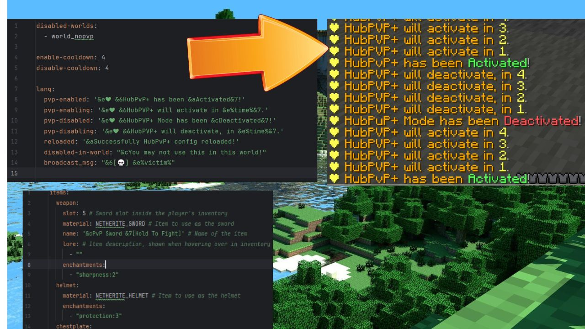

# **HubPvPPlus**

### HubPvPPlus is a light weight, customizable plugin designed to enhance the hub experience of Minecraft servers by enabling PvP combat using a special magic sword.
#### Created by **[Jay Gamerz](https://www.fiverr.com/jay_gamerz)** and **[Kanaiya](https://www.youtube.com/@kanhaiyaswagger.)**, this plugin allows players to easily toggle PvP in the lobby or Hub.

# 📜 Features

Fully customizable: Modify all messages and options via config.yml.
PvP toggling: Equip the magic sword to enable PvP and unequip it to disable PvP.
Easy setup: Simple to install and configure.
Reloadable configurations: Adjust plugin settings without needing to restart the server.
Supports fun interactions: Allows players to battle in the lobby while maintaining flexibility.

# 🚀 How It Works

Players can equip the magic PvP sword to enable PvP mode.
With the sword equipped, players can fight others who also have PvP enabled.
Once the sword is unequipped, the player’s PvP mode is disabled, and they can no longer be attacked.

# 🛠️ Commands

/hpp
Description: Reloads the plugin's configuration.
Permission: hpp.reload (Allows reloading the plugin configuration).
📄 Permissions
hpp.use
Description: Grants permission to use the PvP sword.
Default: true

# 🛑 Version Support

HubPvPPlus natively supports Minecraftrom 1.8 to 1.21  While it may work on earlier versions, support is not guaranteed for them.

# 📥 Installation

Download the plugin from SpigotMC or the GitHub releases.
Place the .jar file into your server’s plugins directory.
Restart your server.
Modify the config.yml file to customize your settings as desired.
Use /hpp to reload the plugin after making changes to the configuration.

# ⚙️ Configuration
The plugin's configuration file (config.yml) allows you to customize all messages, PvP toggling mechanics, and more. After making changes, use /hpp to reload the configuration without restarting the server.
## Configuration File Setup

To configure the `HubPvP+` plugin, follow these steps:

1. **Open the Config File:**
    - Locate the `config.yml` file within the plugin directory.

2. **Edit the Configuration:**
    - Modify the config file as follows:

```yaml
disabled-worlds:
  - world_nopvp
enable-cooldown: 4
disable-cooldown: 4
lang:
  pvp-enabled: '&e❤ &6HubPvP+ has been &aActivated&7!'
  pvp-enabling: '&e❤ &6HubPVP+ will activate in &e%time%&7.'
  pvp-disabled: '&e❤ &6HubPVP+ Mode has been &cDeactivated&7!'
  pvp-disabling: '&e❤ &6HubPVP+ will deactivate, in &e%time%&7.'
  reloaded: '&aSuccessfully HubPvP+ config reloaded!'
  disabled-in-world: "&cYou may not use this in this world!"
  broadcast_msg: "&6[] &e%victim%"
Save and Reload:
```
`Items.yml`
```yaml
items:
  weapon:
    slot: 5 # Sword slot inside the player's inventory
    material: NETHERITE_SWORD # Item to use as the sword
    name: '&cPvP Sword &7[Hold To Fight]' # Name of the item
    lore: # Item description, shown when hovering over in inventory
      - ""
    enchantments:
      - "sharpness:2"
  helmet:
    material: NETHERITE_HELMET # Item to use as the helmet
    enchantments:
      - "protection:3"
  chestplate:
    material: NETHERITE_CHESTPLATE # Item to use as the chestplate
    enchantments:
      - "protection:3"
  leggings:
    material: NETHERITE_LEGGINGS # Item to use as the leggings
    enchantments:
      - "protection:3"
  boots:
    material: NETHERITE_BOOTS # Item to use as the boots
    enchantments:
      - 
```
This keeps your YAML configuration section separate and clear, while smoothly transitioning to the rest of your README content. 📜🛠️
# **For Example**


# 🔗 Download

Get HubPvPPlus from:

## Modrinth [HubPvP Plus](https://modrinth.com/plugin/hubpvpplus)

SpigotMC HubPvPPlus
GitHub Releases

# 🧑‍💻 Authors
#### Developed by:
### [Kanaiya](https://www.youtube.com/@kanhaiyaswagger.)
### [Jay Gamerz](https://www.fiverr.com/jay_gamerz)